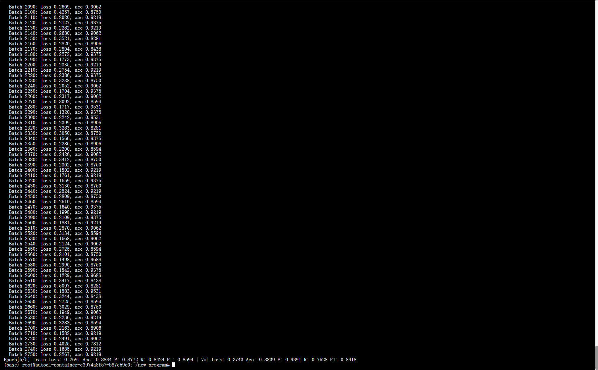
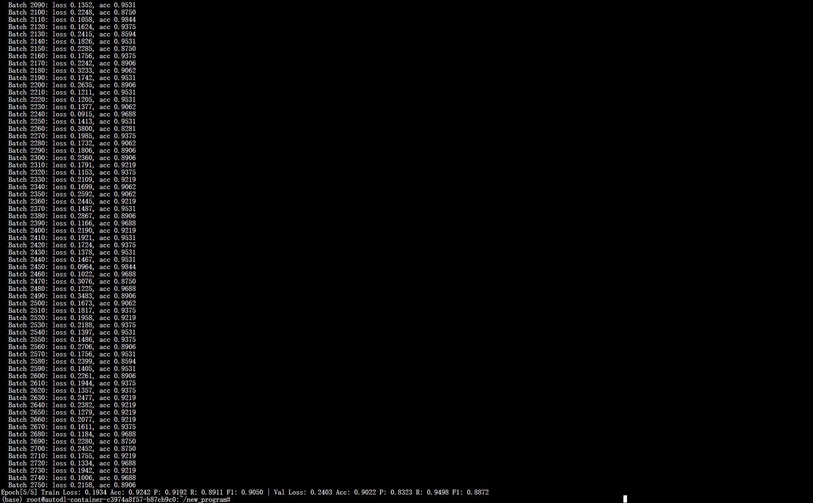

# 实验

## 实验信息

- 实验名称：ResNet34 Baseline
- 实验时间：2025.12.25
- 随机种子：42

## 数据集

- 数据集：PatchCamelyon (PCAM)
- 图像格式：`.tif`
- 图像尺寸：原始 96×96（训练中未 resize）
- 类别数：2（0 / 1）
- 标签文件：train_labels.csv
- 数据划分方式：分层划分（Stratified Split）
  - 训练集：80%
  - 验证集：20%

## 模型（Model）

- 网络结构：ResNet34
- 预训练权重：无（weights=None）
- 输出类别数：2
- 修改说明：
  - 将原 fc 层替换为 Linear(in_features, 2)

## 训练设置（Training Setup）

- 损失函数：CrossEntropyLoss
- 优化器：Adam
  - 学习率：1e-3
- Batch Size：64
- Epoch 数：5
- 数据增强：
  - ToTensor()

## 评估指标（Metrics）

在训练集与验证集上计算以下指标：

- Accuracy
- Precision
- Recall
- F1-score

## 运行环境（Hardware）

## 实验结果

**无预训练（ResNet34）**

| 指标 | Loss | Acc | Precision (P) | Recall (R) | F1 |
| ---- | ---- | ---- | ---- | ---- | ---- |
| Train | 0.2691 | 0.8884 | 0.8772 | 0.8424 | 0.8594 |
| Val | 0.2743 | 0.8839 | 0.9391 | 0.7628 | 0.8418 |

**加载本地权重**

**无预训练（ResNet34）**

| 指标 | Loss | Acc | Precision (P) | Recall (R) | F1 |
| ---- | ---- | ---- | ---- | ---- | ---- |
| Train | 0.1934 | 0.9242 | 0.9192 | 0.8911 | 0.9050 |
| Val  | 0.2403 | 0.9022 | 0.8323 | 0.9498 | 0.8872 |

## 观察与结论

- ResNet34 在未使用预训练权重的情况下，可以在 96×96 的 PCAM 图像上正常收敛，验证了训练流程的正确性
- 与从零训练相比，加载已有 checkpoint 后，模型在训练集和验证集上的 Acc 与 F1 均有提升，说明继续训练已有模型是有效的
- 未加载权重时模型预测偏保守（Precision 高、Recall 低）；加载权重后 Recall 明显提升，但 Precision 有所下降，体现了精度与召回之间的权衡
- 模型已经接近收敛,继续训练可能只带来小幅提升，若想显著优化需要调整策略
